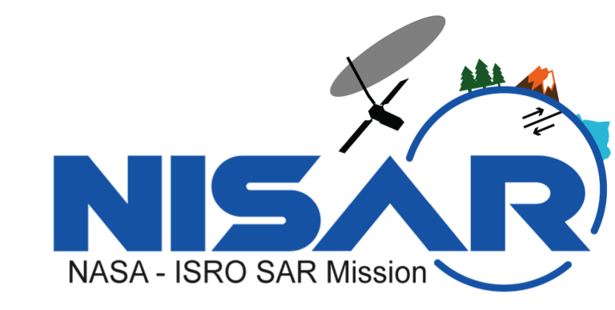

# Start Here

---

## NISAR Early Adopters Workshop: *Moving Processing to the Cloud*

This Jupyter Book holds content from the **October 2024 NISAR Early Adopters Workshop: Moving Processing to the Cloud**, hosted by the [Alaska Satellite Facility DAAC](https://asf.alaska.edu/) in cooperation with the [NISAR Early Adopters Program](https://nisar.jpl.nasa.gov/engagement/early-adopters/).

*Disclaimer: This Jupyter Book was developed specifically for a 2-day workshop and will not be updated or maintained in the future.*

 

<b> <u>Jupyter Book Navigation</u></b>

For an improved Jupyter Book Experience in JupyterLab, try installing the [jupyterlab-jupyterbook-navigation](https://pypi.org/project/jupyterlab-jupyterbook-navigation/) JupyterLab extension.

---

## How To Use This Jupyter Book

>1. ### Install the software environment needed to run the notebook
>
>    - Run the **Install Required Software with Conda** notebook ([Software_Environment.ipynb](Software_Environment.ipynb))
>
>1. ### Explore the remaining notebooks, slides, and resources
